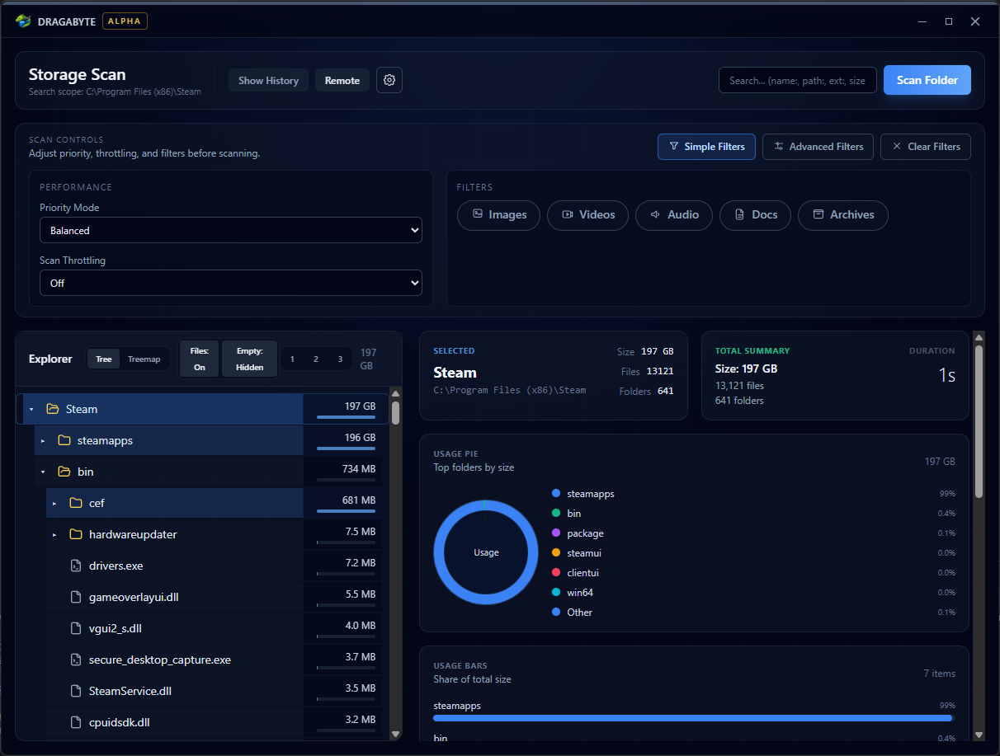

<p align="center">
	
</p>

# Dragabyte

<p align="center">
	
</p>

Dragabyte is a desktop storage analysis app that turns disk usage into clear, actionable insights. It is built for speed, transparency, and clean-up workflows that scale from power users to IT teams.

**Status:** Alpha — core UX and scanning workflows are in active development, and features may change rapidly.

> [!WARNING]
> Alpha builds can change quickly. If you rely on a specific workflow, keep the app pinned to a known version.

## Contents

- [At a Glance](#at-a-glance)
- [Who It’s For](#who-its-for)
- [Core Workflows](#core-workflows)
- [Quick Start](#quick-start)
- [Feature Status](#feature-status)
- [Design Principles](#design-principles)
- [Scripts](#scripts)
- [Tech Stack](#tech-stack)

## At a Glance

- **Fast scans** with live progress and prioritization controls.
- **Visual breakdowns** using treemap, pie, and bar views.
- **Actionable cleanup** with large-file focus and deep filters.
- **Audit-friendly** views with history shortcuts and per-item details.

## Who It’s For

- Power users who want immediate, no-nonsense disk visibility.
- IT teams preparing cleanup, audit, or migration workflows.
- Anyone who wants storage insights without waiting on slow scans.

## Core Workflows

1. **Scan a folder** and watch usage populate live.
2. **Explore results** in a tree view or switch to visual charts.
3. **Pinpoint waste** using filters, search tokens, and top files.
4. **Inspect details** per item before taking action.

## Quick Start

### Prerequisites

- Node.js (LTS)
- Rust toolchain
- Tauri prerequisites for your OS

#### Linux build dependencies

- `libgtk-3-dev`
- `libayatana-appindicator3-dev`
- `libwebkit2gtk-4.1-dev`
- `webkit2gtk-driver` (for WebDriver testing)
- `xvfb` (for headless CI or windowless runs)

### Run the app

1. Install dependencies.
2. Start the Tauri dev build.

```
npm install
npm run tauri:dev
```

<details>
<summary>Advanced setup notes</summary>

- Install OS-specific Tauri prerequisites before the first build.
- If build tooling fails, verify your Rust toolchain is up to date.

</details>

### Build a release

```
npm run tauri:build
```

## Feature Status

### Ready

- Local folder scanning with live progress updates.
- Tree-style explorer with expandable folder breakdowns.
- Treemap, pie, and bar visualizations for space usage.
- Largest files list (top 10).
- Per-item details modal.
- Scan history shortcuts.
- Scan performance controls (priority + throttling).
- Optional Windows Explorer context menu integration.
- Open scans in a dedicated window.
- Advanced filters (extensions, name contains, size range, path contains, regex).
- Advanced search tokens (name, path, extension, size, regex).
- Remote Dashboard for managing headless instances over TCP.
- Remote file preview (limit 5MB).
- Professional reports (PDF, Excel, HTML, CSV).
- Auto-updater.
- Linux bundles (deb/rpm/appimage).

### In Progress

- Search and filters (age/metadata filters pending).

### Planned

#### Search & Cleanup

- Advanced file search by size, age, type, and metadata.
- Duplicate file and folder detection.
- ZIP archive searching.
- Bulk actions: move, delete, archive, rename, copy.

#### Reporting & Automation

- Email-ready report generation.
- Command-line and task scheduler integration.
- Reusable search templates and scheduled scans.

#### File System Insights

- NTFS details (compression, permissions, hardlink awareness).
- Long-path support.
- Multithreaded scanning for large datasets.

#### Planned Milestones

- [ ] Duplicate detection and safe review flow
- [x] Exportable reports (PDF, CSV, HTML)
- [ ] Scheduled scans and reusable templates

## Design Principles

- **Clarity over clutter:** views are focused and purposeful.
- **Speed first:** scanning and navigation should feel instant.
- **Confidence for action:** every cleanup step is explainable.

> [!NOTE]
> Scan speed varies by disk type, permissions, and directory size.[^perf]

## Scripts

| Script                | Purpose                    |
| --------------------- | -------------------------- |
| `npm run tauri:dev`   | Start the Tauri dev build. |
| `npm run tauri:build` | Build a release bundle.    |

## Tech Stack

- Tauri 2.0 + Rust
- React + TypeScript
- Tailwind CSS + shadcn/ui
- TanStack Router + TanStack Query

## Linux Support

Dragabyte ships Linux bundle targets via `src-tauri/tauri.linux.conf.json`. The Linux config is merged using JSON Merge Patch during builds, allowing Linux-specific bundle settings without affecting Windows or macOS builds.

## Headless Mode & Remote Management

Dragabyte can run without a GUI for server workflows and remote administration. Headless mode starts the TCP management server and avoids creating any windows.

### CLI flags

- `--headless` Runs Dragabyte without a GUI (requires `--tcp`).
- `--tcp` Enables TCP management on `127.0.0.1:4799` by default.
- `--tcp-bind=HOST:PORT` Overrides the bind address.
- `--tcp-token=TOKEN` Requires the token for all TCP requests.

### Environment variables

- `DRAGABYTE_HEADLESS=1` Enables headless mode.
- `DRAGABYTE_TCP_BIND=127.0.0.1:4799` TCP bind address.
- `DRAGABYTE_TCP_TOKEN=change_me` Shared secret for TCP access.

### TCP protocol (NDJSON)

Each line is a JSON object with an `action` field. Responses are JSON with an `event` field. All scan events stream back to every connected client.

Example request:

```
{"action":"ping","id":"1"}
```

Example scan:

```
{"action":"scan","id":"scan-1","path":"/data","options":{"priorityMode":"balanced","throttleLevel":"low","filters":{}}}
```

### Security best practices

- Bind to `127.0.0.1` unless you’re running behind a secure tunnel.
- Use a TCP token for any non-loopback binding.
- Prefer TLS or mTLS termination via a reverse proxy or SSH tunnel for remote access.
- Rate-limit requests and monitor logs when exposing the port to administrators.

## Headless CI tips

When running Dragabyte tests or UI automation on Linux without a display, use Xvfb. For concurrent CI runs, prefer `xvfb-run -a` to avoid display collisions.

[^perf]: Performance can differ significantly between SSDs, HDDs, network drives, and restricted folders.
